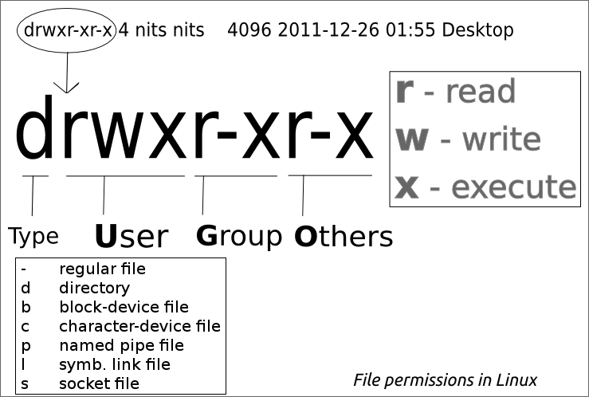
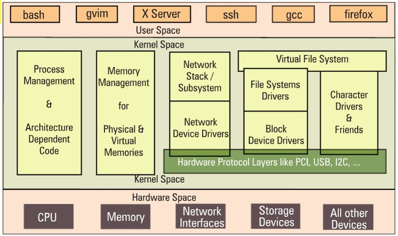
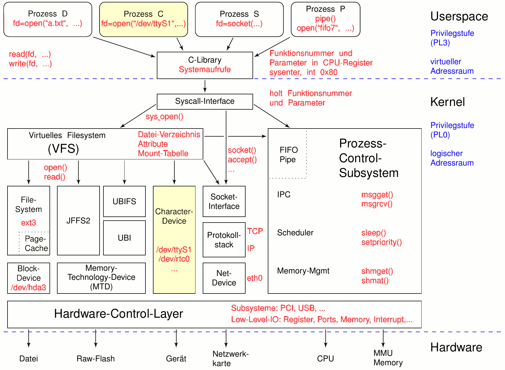

# Zugriffsrechte und Dateiart

* Unter Linux werden die Zugriffsrechte standardmäßig in die Benutzergruppen **Owner** \(u\), **Group** \(g\) und **Others** \(o\) unterteilt. Für jede dieser Gruppen können Lese-, Schreib- und Ausführrechte **\(r, w, x\)** vergeben werden.
* Als mögliche Dateiarten lassen sich nennen:
  * **-** Regular File
  * **d** directory
  * **b** block-device file
  * **c** character-device file
  * **p** named pipe file
  * **l** symbolic link file
  * **s** socket file
* Über [ACL's↑](https://wiki.ubuntuusers.de/ACL/) \(Access Control List\) lassen sich granularere Zugriffsrechte zuweisen

